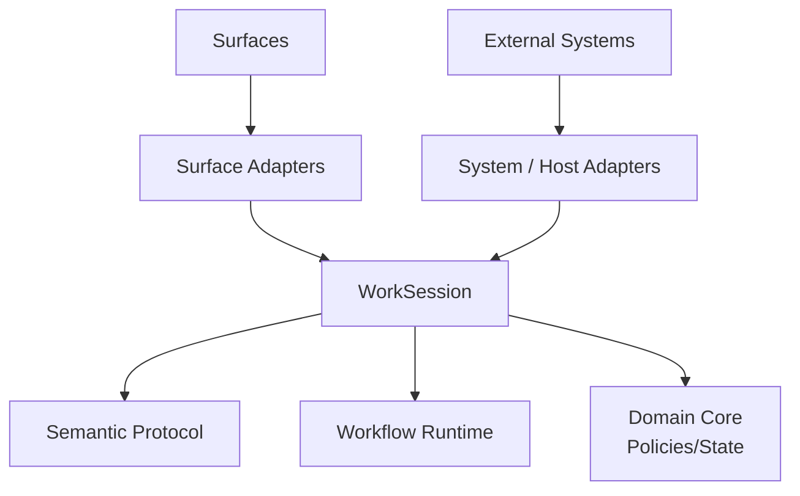
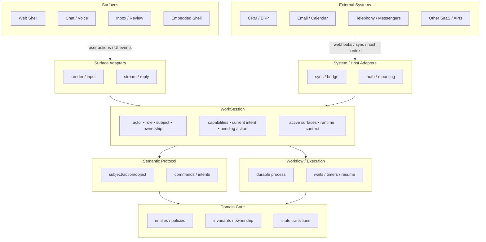

# Worken OS

[](LICENSE)

Worken OS is a place where humans and AI work together.

Under the hood, it is an operational model that ties together interaction surfaces, external systems, semantic interpretation, durable workflows, and domain policy around a single runtime object: **WorkSession**.

## Headless kernel (v0)

The repository includes a **browser-independent** layer that compiles **semantic** and **platform** graphs, builds **compact context bundles** for code agents, and can expose read-only access via **MCP** (Model Context Protocol). Shells and UIs are future renderers; the same graphs back agents and tooling.

Flow: **manifests / sources → graphs → context bundles → MCP**.

| Package | Role |
|---------|------|
| `@worken/ids` | Stable ids, `NodeRef`, canonical addressing |
| `@worken/semantic-core` | Operational semantic graph, predicates, `evaluateAction` |
| `@worken/platform-core` | Contributor/platform graph (subsystems, packages, contracts, invariants, …) |
| `@worken/session-core` | Minimal `WorkSession` / `createSession` |
| `@worken/context-core` | `ContextBundle`, `buildContextBundle`, task presets (`add_adapter`, …) |
| `@worken/testkit` | Graph fixtures and bundle assertions |
| `@worken/platform-mcp` | Read-only MCP server: resources (`worken://…`), tools (`get_node`, `bundle_for_task`, …), prompts |

See `docs/adrs/0002-headless-kernel.md` and `docs/spec/semantic-protocol.md` for protocol details.

### Minimal example

`examples/minimal` is a **demo dataset** (small semantic + platform sources). It uses the same libraries as the rest of the repo: graphs are compiled, then passed into **`@worken/platform-mcp`** (`createPlatformMcpServer`). It does not replace “Worken OS” — it shows the wiring; a production setup feeds the same server **larger graphs** built from your canonical manifests or codegen.

See `examples/minimal/README.md` for details.

```bash
cd examples/minimal
bun run build
bun run build-bundle
# bun run mcp-server   # stdio MCP; configure your client to launch this command
```

## Architecture (overview)



WorkSession is the hub: surfaces and host systems feed adapters, which update session state; semantics and workflows read that context, and the domain core enforces invariants and transitions.

## Architecture (detailed)



## Repository layout

| Path | Role |
|------|------|
| `apps/landing` | Next.js app (marketing / shell entrypoints) |
| `packages/tsconfig` | Shared TypeScript presets (`@worken/tsconfig`) |
| `packages/*` | Libraries: ids, semantic-core, platform-core, session-core, context-core, testkit, platform-mcp |
| `examples/minimal` | Minimal semantic + platform sources, bundle build, MCP bootstrap |
| `docs/spec/semantic-protocol.md` | Semantic protocol specification |
| `docs/adrs/` | Architecture decision records |

## Development

**Prerequisites:** [Bun](https://bun.sh)

This repo is a [Turborepo](https://turbo.build/repo) monorepo.

Install dependencies and run tasks from the repository root:

```bash
git clone https://github.com/WorkenAI/os.git
cd os
bun install
bun run dev
```

Useful root scripts:

| Command | Purpose |
|---------|---------|
| `bun run build` | Build all packages and apps |
| `bun run test` | Run package unit tests |
| `bun run check-types` | Typecheck workspaces |
| `bun run lint` | Lint (Biome) |

## Contributing

Issues and pull requests are welcome. For larger changes, open an issue first so we can align on direction and scope.

- Keep commits focused and messages descriptive.
- Run `bun run lint` and `bun run check-types` before submitting when you touch that app.
- For `packages/*` changes, run `bun run test` when relevant.
