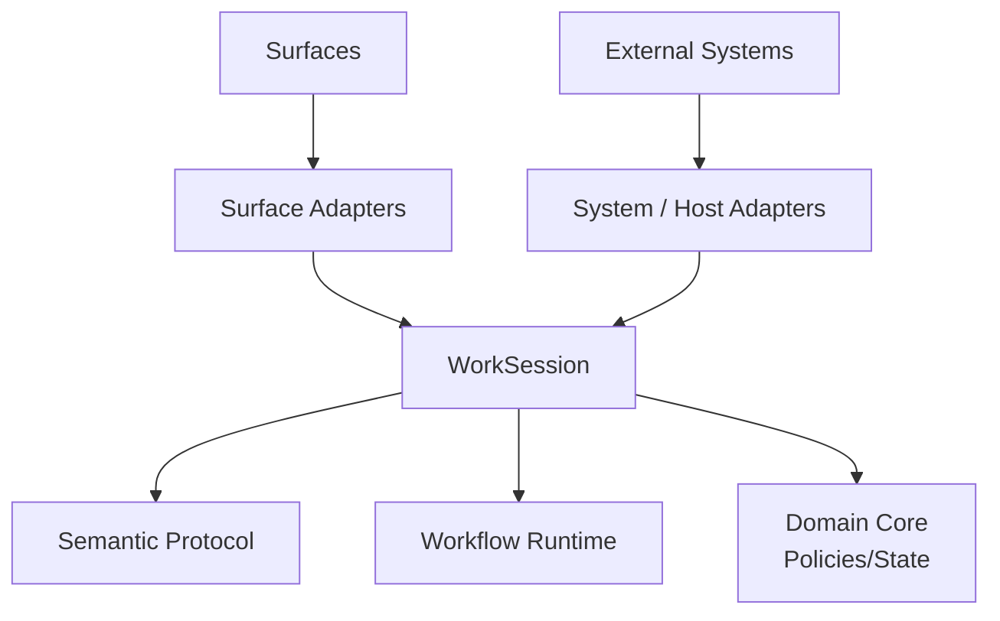
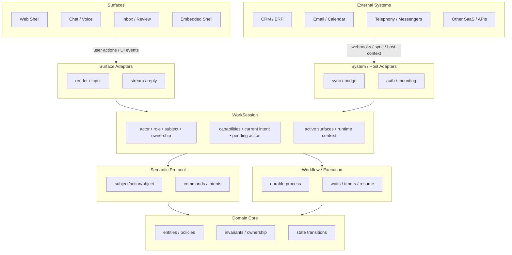

# Worken OS

[](LICENSE)

Worken OS is a place where humans and AI work together.

Under the hood, it is an operational model that ties together interaction surfaces, external systems, semantic interpretation, durable workflows, and domain policy around a single runtime object: **WorkSession**.

## Architecture (overview)



WorkSession is the hub: surfaces and host systems feed adapters, which update session state; semantics and workflows read that context, and the domain core enforces invariants and transitions.

## Architecture (detailed)



## Repository layout

| Path | Role |
|------|------|
| `apps/landing` | Next.js app (marketing / shell entrypoints) |
| `packages/tsconfig` | Shared TypeScript presets (`@worken/tsconfig`) |

## Development

**Prerequisites:** [Bun](https://bun.sh)

This repo is a [Turborepo](https://turbo.build/repo) monorepo. 

Install dependencies and run tasks from the repository root:

```bash
git clone https://github.com/WorkenAI/os.git
cd os
bun install
bun run dev
```

## Contributing

Issues and pull requests are welcome. For larger changes, open an issue first so we can align on direction and scope.

- Keep commits focused and messages descriptive.
- Run `bun run lint` and `bun run check-types` before submitting when you touch that app.
